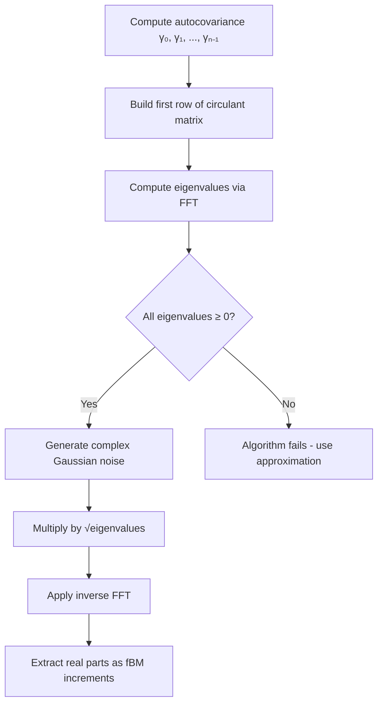

# Fractional Brownian Motion: Theory and Implementation

This document explains the mathematical foundations and implementation details of the `DaviesHarte` class in `fbm.py`.

---

## 1. What is Fractional Brownian Motion (fBM)?

**Fractional Brownian motion** is a generalization of standard Brownian motion parameterized by the **Hurst exponent** $H \in (0, 1)$.

| Hurst Parameter | Behavior | Interpretation |
|-----------------|----------|----------------|
| $H = 0.5$ | Standard Brownian motion | No memory |
| $H > 0.5$ | Persistent / smooth paths | Positive autocorrelation |
| $H < 0.5$ | Anti-persistent / rough paths | Negative autocorrelation |

### Why $H \approx 0.1$ for Finance?

Empirical studies (Gatheral, Jaisson, Rosenbaum 2018) show that **implied volatility surfaces** in equity markets exhibit roughness consistent with $H \approx 0.1$. This "rough volatility" cannot be captured by standard diffusions.

---

## 2. The Covariance Structure

For an fBM process $B^H_t$, the covariance is:

$$\mathbb{E}[B^H_t B^H_s] = \frac{1}{2}\left(t^{2H} + s^{2H} - |t-s|^{2H}\right)$$

For **increments** $\Delta B^H_k = B^H_{(k+1)\Delta t} - B^H_{k\Delta t}$, the autocovariance is:

$$\gamma(k) = \frac{\Delta t^{2H}}{2}\left(|k+1|^{2H} - 2|k|^{2H} + |k-1|^{2H}\right)$$

> [!NOTE]
> When $H = 0.5$, this reduces to $\gamma(0) = \Delta t$ and $\gamma(k) = 0$ for $k \neq 0$, recovering independent increments.

---

## 3. The Davies-Harte Algorithm

The **Davies-Harte algorithm** is an exact method for simulating stationary Gaussian processes via **circulant embedding**.

### Algorithm Steps



### Why Circulant Embedding?

A **circulant matrix** is diagonalized by the DFT matrix, so:
- Matrix-vector multiplication becomes element-wise multiplication in Fourier space
- Complexity reduces from $O(n^2)$ to $O(n \log n)$

---

## 4. Implementation Details in `fbm.py`

### Class: `DaviesHarte`

```python
class DaviesHarte:
    def __init__(self, n_steps: int, batch_size: int, H: float, T: float):
        """
        n_steps    : Number of time discretization steps
        batch_size : Number of independent paths to generate
        H          : Hurst exponent (0 < H < 0.5 for rough volatility)
        T          : Time horizon
        """
```

### Key Methods

| Method | Purpose |
|--------|---------|
| `_autocovariance(k)` | Computes $\gamma(k)$ for the increment process |
| `_build_eigenvalues()` | Constructs circulant row and computes FFT eigenvalues |
| `sample()` | Generates `batch_size` paths of fBM increments |

### Scaling

The increments are scaled so that:

$$\text{Var}(\Delta B^H) = \Delta t^{2H}$$

This is crucial for the statistical tests in `test_fbm.py`.

---

## 5. Connection to the Overall Framework

This fBM generator will be used in later phases to drive the rough volatility SDE:

$$dX_t = \mu(t, X_t)dt + \sqrt{v_t} \, dW^H_t$$

The rough noise $dW^H_t$ comes directly from the increments generated by `DaviesHarte.sample()`.

---

## References

1. Davies, R.B. & Harte, D.S. (1987). "Tests for Hurst effect"
2. Gatheral, J., Jaisson, T., & Rosenbaum, M. (2018). "Volatility is Rough"
3. Dieker, A.B. (2004). "Simulation of Fractional Brownian Motion"
