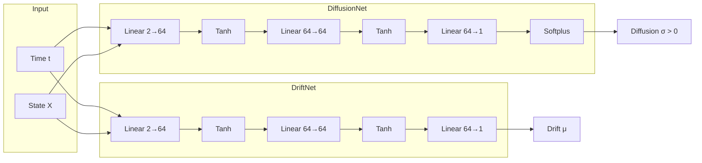

# Rough Neural SDE Generator: Architecture and Theory

This document explains the `RoughNeuralSDE` class in `generator.py`.

---

## 1. The Problem: Why Can't We Use Standard SDE Solvers?

Standard Neural SDE libraries like `torchsde` assume the driving noise is **Brownian motion** ($H = 0.5$). For fractional Brownian motion with $H < 0.5$:

| Issue | Explanation |
|-------|-------------|
| **Itô calculus fails** | The quadratic variation of fBM is infinite for $H < 0.5$ |
| **No martingale property** | fBM is not a semimartingale, so Itô integrals are undefined |

> [!IMPORTANT]
> We must use **Rough Path Theory** or treat fBM as a deterministic control signal.

---

## 2. The Solution: Controlled Differential Equations (CDEs)

Instead of the stochastic integral interpretation, we solve:

$$dZ_t = f_\theta(t, Z_t) \, dt + g_\phi(t, Z_t) \, du(t)$$

where $u(t) = B^H_t$ is the pre-computed fBM path from Phase 1.

**Key insight:** Once the fBM path is sampled, the equation becomes a deterministic ODE with a known "forcing" term $du$.

---

## 3. Euler-Heun Scheme

We use a **predictor-corrector** method for better accuracy:

### Step 1: Predictor (Euler)
$$\tilde{Z}_{t+\Delta t} = Z_t + f(t, Z_t) \Delta t + g(t, Z_t) \Delta u_t$$

### Step 2: Corrector (Heun)
$$Z_{t+\Delta t} = Z_t + \frac{1}{2}\left[f(t, Z_t) + f(t+\Delta t, \tilde{Z})\right] \Delta t + \frac{1}{2}\left[g(t, Z_t) + g(t+\Delta t, \tilde{Z})\right] \Delta u_t$$

where $\Delta u_t = u(t + \Delta t) - u(t)$ are the fBM increments.

---

## 4. Network Architecture



### Why Softplus on Diffusion?

The diffusion coefficient must be **positive** to ensure well-defined dynamics:
$$\text{softplus}(x) = \log(1 + e^x) > 0$$

---

## 5. Forward Pass

```python
def forward(self, fbm_generator, x0=None):
    """
    Generate price paths driven by fractional Brownian motion.
    
    1. Sample fBM increments from the DaviesHarte generator
    2. Solve the CDE using Euler-Heun
    3. Return paths of shape (batch_size, n_steps + 1)
    """
```

---

## 6. Connection to Rough Volatility

In the full rough volatility model:

$$dX_t = \mu(t, X_t) \, dt + \sqrt{v_t} \, dW^H_t$$

The diffusion network $g_\phi$ learns to approximate $\sqrt{v_t}$, while the drift network $f_\theta$ captures the mean dynamics.
